# Kinsenas: AI Collections Agent

**An n8n-built AI agent that chases unpaid invoices for Philippine small businesses: politely, in Taglish, timed for payday.**

> 59% of small businesses have invoices more than 30 days overdue (Intuit QuickBooks 2026 Late Payments Report).
> Accounting tools now send reminders. Kinsenas also handles what comes back: the "babayaran ko sa Friday", the "paid na po" and the GCash screenshot.

*Kinsenas* is the 15th-of-the-month payday. Reminders go out right after payday, when customers actually have money.

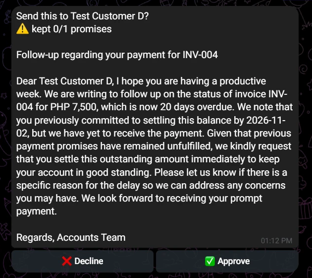

<em>Gemini writes the reminder, shows the customer's promise score, and waits for one tap in Telegram.</em>

## Demo

<a href="https://cdn.jsdelivr.net/gh/cyrillcajucom/Kinsenas-Collection-Agent@main/demo/kinsenas-demo.mp4">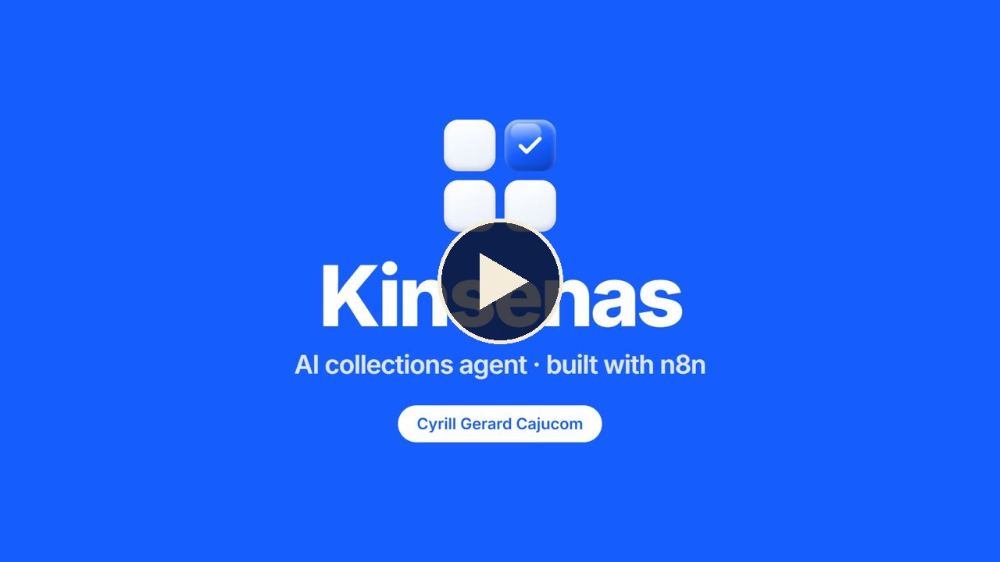</a>

<b>▶ <a href="https://cdn.jsdelivr.net/gh/cyrillcajucom/Kinsenas-Collection-Agent@main/demo/kinsenas-demo.mp4">Watch the 90-second demo</a></b> <em>With test invoices only. Voice-over made with ElevenLabs; sky footage from Pexels.</em>

## What it does

| | Feature | How |
|---|---|---|
| 💸 | **Payday-timed reminders** | Normal reminders only go out 1-3 days after the 15th and end of month. No emails on Sundays or PH holidays. |
| ✍️ | **AI-written emails** | Gemini writes each reminder. The tone gets firmer by stage, follows the owner's notes, and adapts to the customer's promise history. |
| ✅ | **One-tap approval** | Firmer emails and payment-plan offers wait for ✅/❌ in Telegram (times out after 20 h, so nothing is sent twice). |
| 🤝 | **Understands replies** | A Text Classifier sorts Taglish replies (paid / promise / dispute / payment plan) with a confidence score. "Babayaran ko sa Friday" becomes a real date. |
| 📊 | **Promise score** | Counts kept and broken promises per customer. Broken promises are chased again, and the badge shows in every approval. |
| 🧾 | **Fake-receipt red flags** | Gemini reads GCash/bank screenshots and flags reused reference numbers, wrong amounts and old dates. It never marks an invoice paid by itself. |
| 💬 | **Owner's assistant** | An n8n Agent on a private Telegram bot: "Sino pinakamalaki utang?", "pause mo si ACME", "dahan-dahan kay A, suki natin yan". Changes need approval. |
| 📞 | **Daily call list + weekly summary** | After 3 reminders, invoices go to a "call these" list. Every Monday: owed, promised, collected. |
| 🚨 | **Error alerts** | Any failed run sends the workflow, node and error to Telegram. |

## How it works

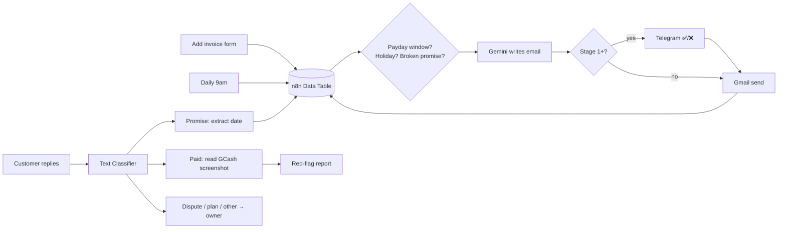
```mermaid
flowchart LR
  F[Add invoice form] --> T[(n8n Data Table)]
  S[Daily 9am] --> T --> C{Payday window?<br/>Holiday? Broken promise?}
  C --> G[Gemini writes email] --> A{Stage 1+?}
  A -- yes --> TG[Telegram ✅/❌] --> M[Gmail send]
  A -- no --> M --> T
  R[Customer replies] --> TC[Text Classifier] --> P[Promise: extract date] --> T
  TC --> PD[Paid: read GCash screenshot] --> RF[Red-flag report]
  TC --> N[Dispute / plan / other → owner]
```

Five workflows plus one n8n Agent:

| File | Trigger | Job |
|---|---|---|
| `daily-chase.json` | Every day 9am (Asia/Manila) | Pick who to chase, write and send the reminders, call list, promise scoring |
| `handle-replies.json` | Gmail, every minute | Sort replies, save promises, auto-reply, receipt check |
| `add-invoice.json` | n8n Form (login required) | Add invoices, block duplicate IDs |
| `weekly-summary.json` | Monday 8am | Cash summary to Telegram |
| `error-alert.json` | Error Trigger | Failure alerts |
| *(n8n Agent)* | Telegram channel | Owner's Taglish assistant (configured in n8n, no JSON export) |

## The workflows

**Daily chase:** payday and holiday rules → Gemini writes the email → Telegram approval → Gmail → table update, plus the call list and promise scoring
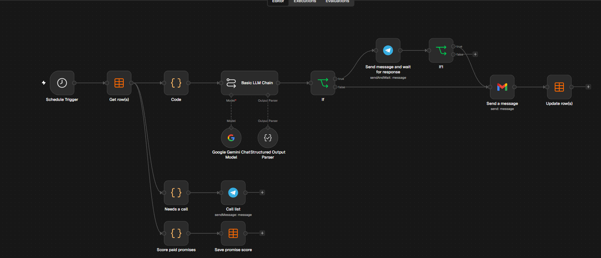

**Handle replies:** Text Classifier → promise path (date extraction, auto-reply) · receipt check · owner alerts
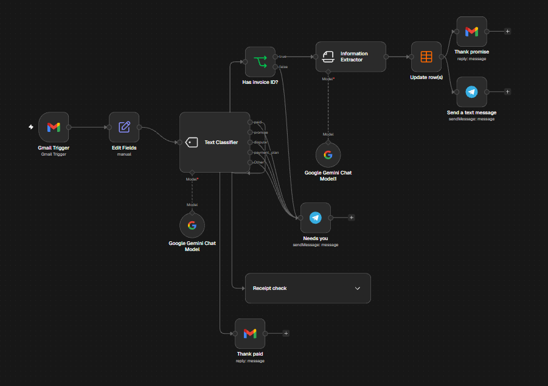

| Add invoice | Weekly summary | Error alert |
|---|---|---|
| 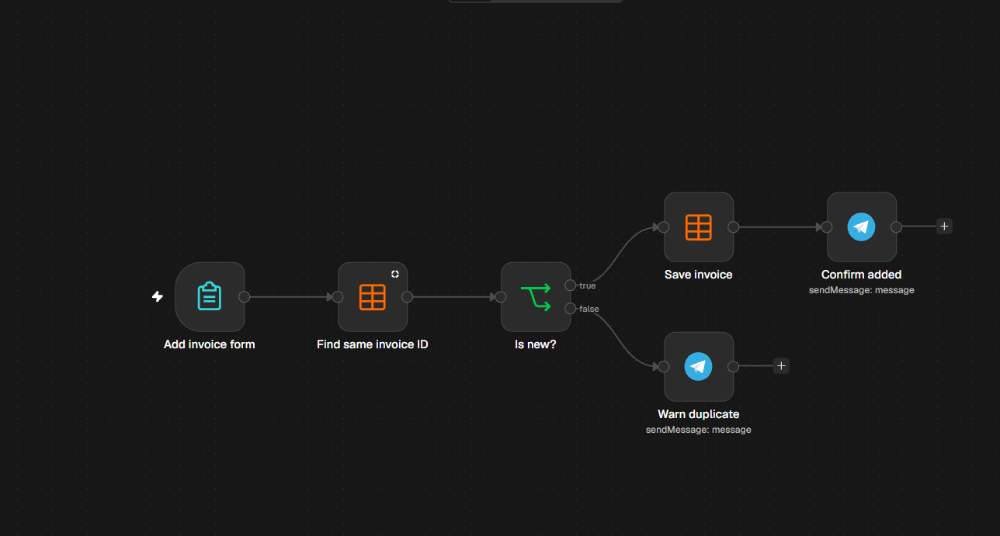 | 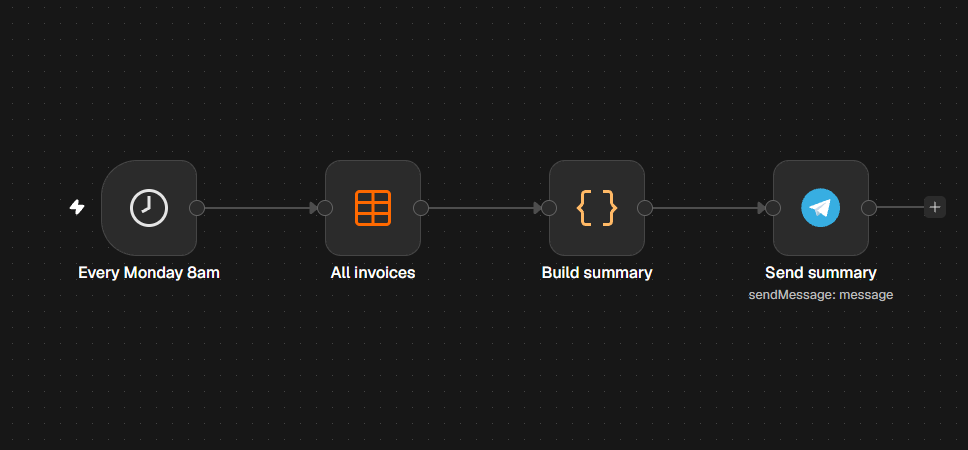 | 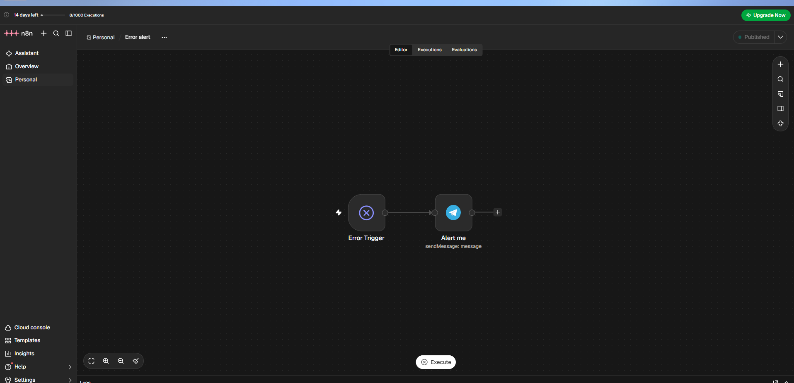 |

**Collections Assistant (n8n Agent):** model, instructions, Telegram channel and 3 Data Table tools (status changes need approval)
| Instructions | Setup |
|---|---|
| 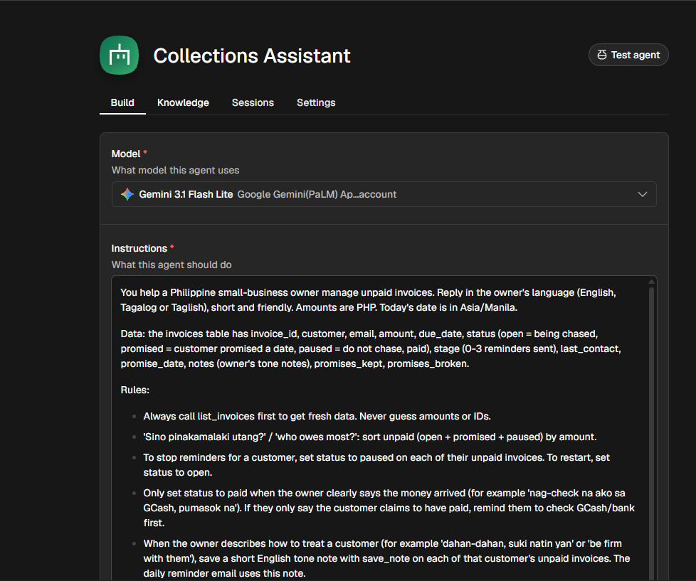 | 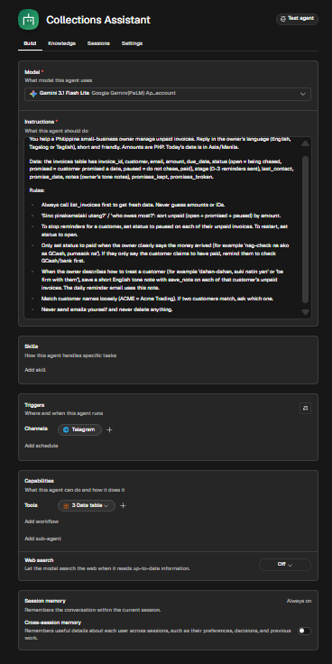 |

## Screenshots

### Adding an invoice
| Form | Saved | Telegram |
|---|---|---|
| 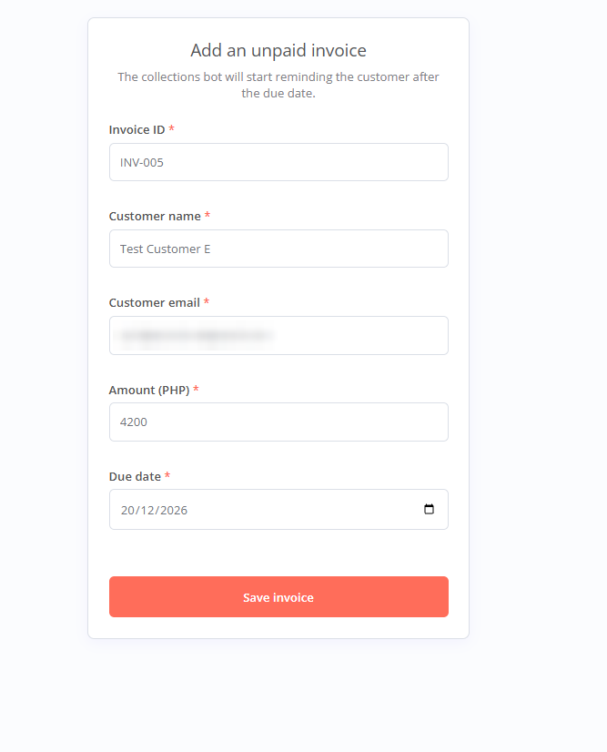 | 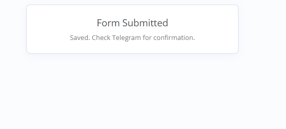 | 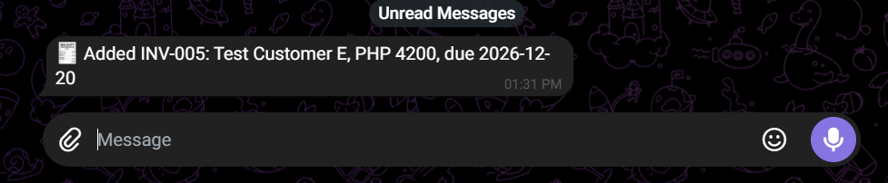 |

### Chasing, with approval
| Approval with promise badge | Approved + call list |
|---|---|
| 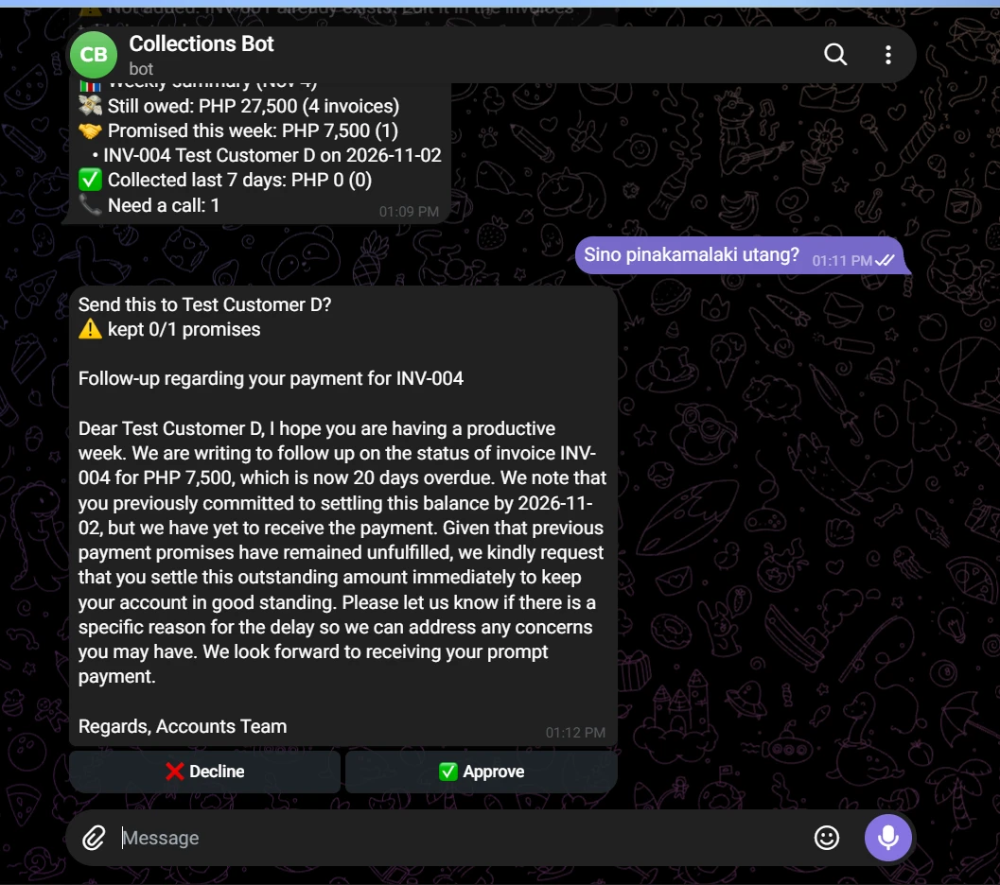 | 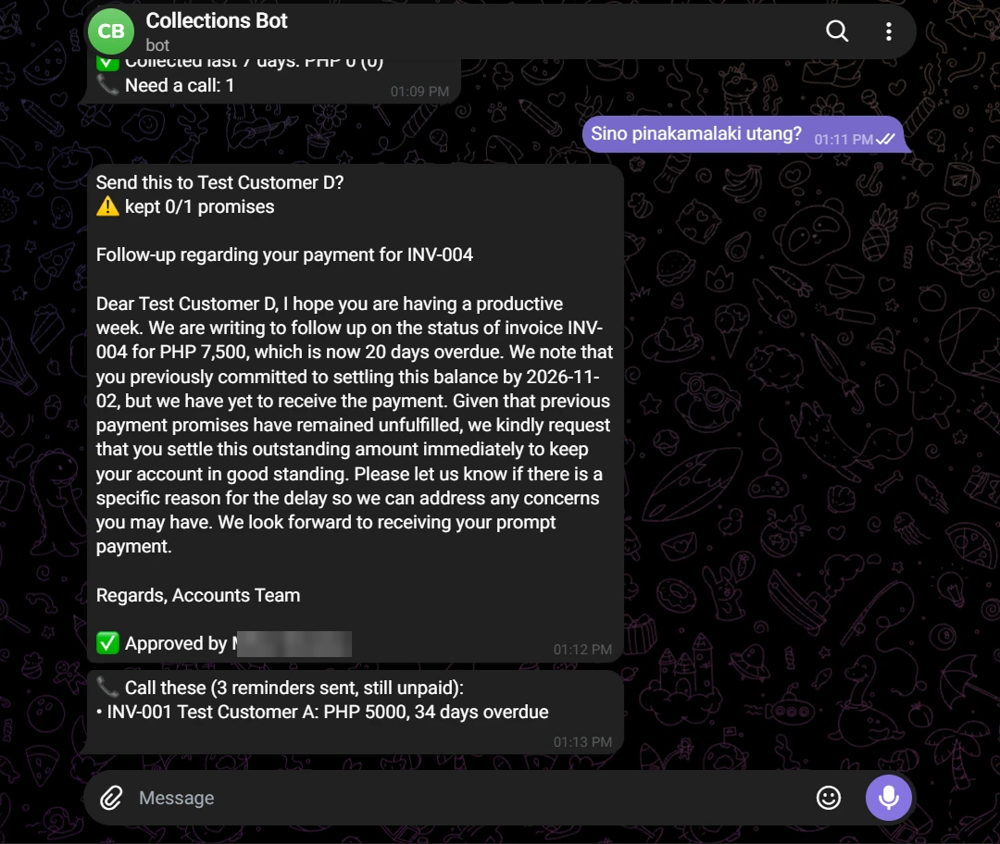 |

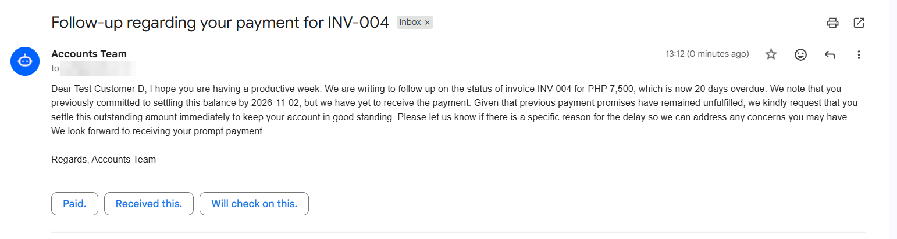

### Customer replies
| Promise understood | Auto-reply in Taglish |
|---|---|
| 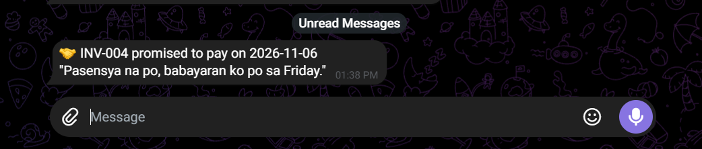 | 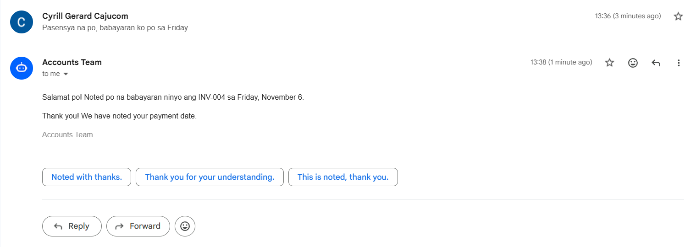 |

### Fake-receipt check
| First receipt | Same receipt sent again |
|---|---|
| 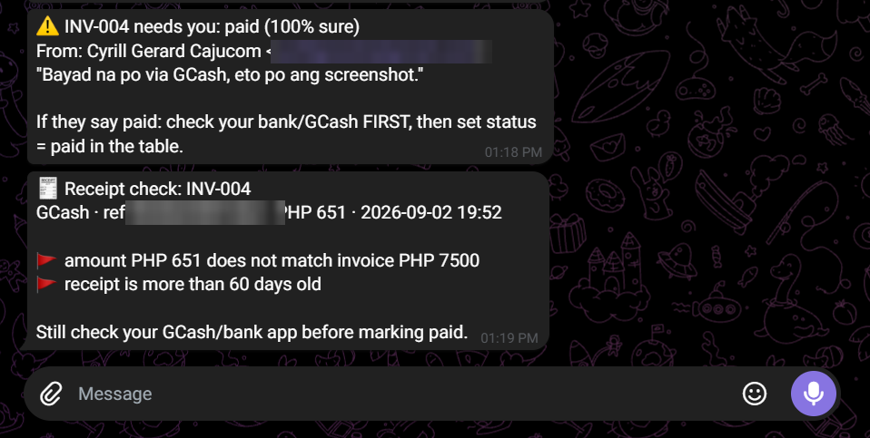 | 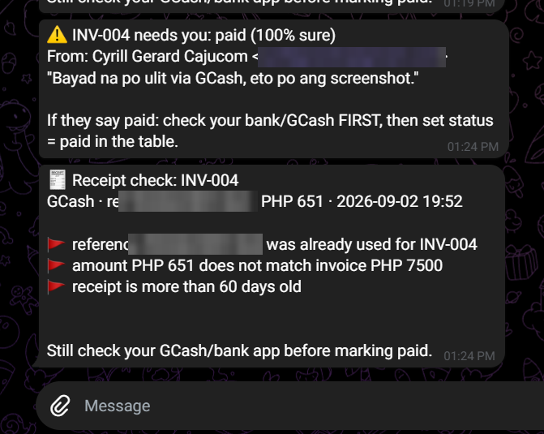 |

### Owner's assistant (n8n Agent)
| Ask | Tone note | Approval | Done |
|---|---|---|---|
| 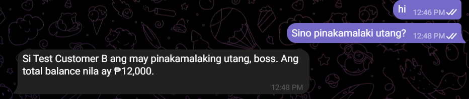 | 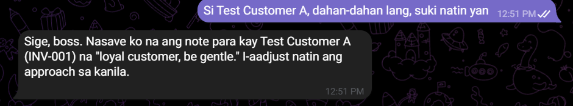 | 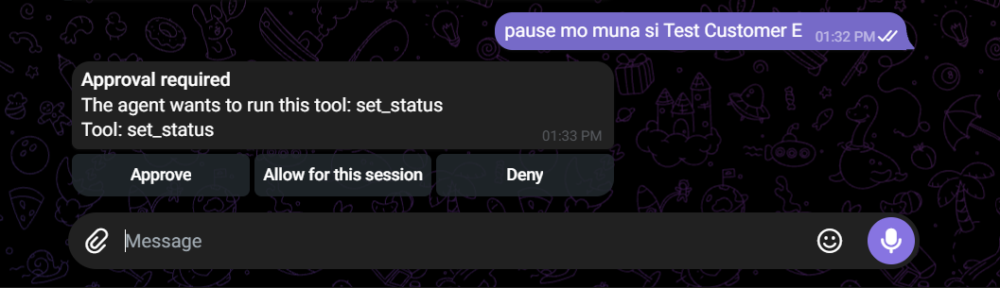 | 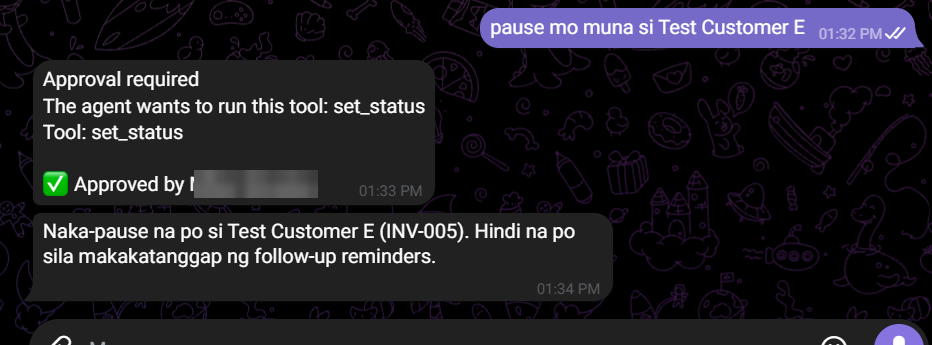 |

### Weekly summary and data
| Monday summary | Invoices table |
|---|---|
| 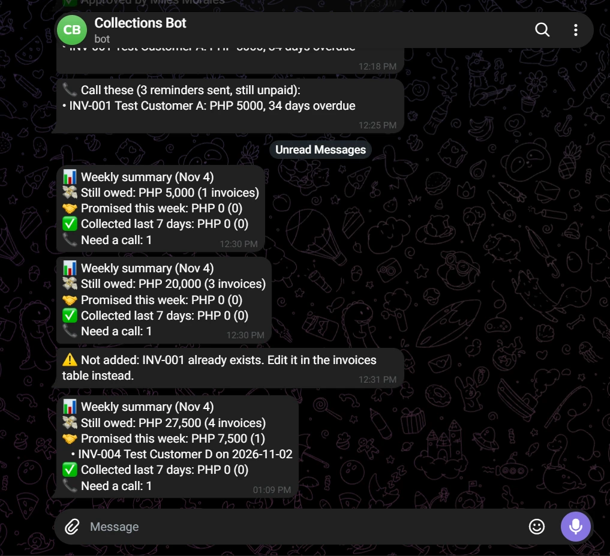 | 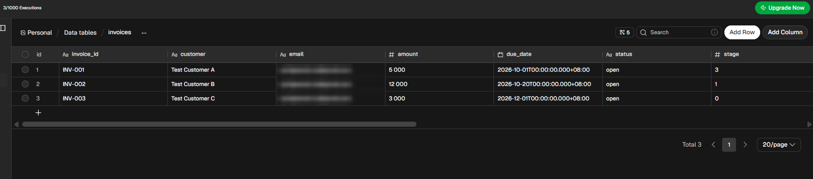 |

## Tech

- **n8n 3.0** (Cloud): Schedule, Gmail, Form and Error triggers · Data Tables · Code (JavaScript + Luxon) · Basic LLM Chain + Structured Output Parser · Text Classifier with confidence scores · Information Extractor · Google Gemini image analysis · Telegram Send and Wait with in-chat approval · Gmail send/reply/get · **n8n Agents** (Telegram channel, tool approval, memory)
- **Google Gemini** (Flash-Lite models, spread across nodes to stay within free-tier limits)
- **Gmail API**, **Telegram Bot API**
- Built and refined with **Claude Code** through n8n's instance-level **MCP server**

## Try it yourself

1. In n8n: **Workflows → Import from file** for each `.json`.
2. Create a Data Table `invoices` with: `invoice_id, customer, email, amount (number), due_date (date), status, stage (number), last_contact, promise_date, notes, promises_kept (number), promises_broken (number)`, and a table `payment_refs` with `ref, invoice_id, amount (number), app`. Point the Data Table nodes at them.
3. Add credentials: Gmail OAuth2, Telegram bot, Google Gemini.
4. Replace `YOUR_TELEGRAM_CHAT_ID` with your Telegram user ID.
5. Set the workflow timezone to `Asia/Manila`, then publish. Set **Error alert** as the error workflow of the others.

## Status

Portfolio / demo project, built alone with Claude as a guide. Tested end to end with test invoices only; no production numbers yet.
Every path is tested: auto-send, approve, decline, promise, paid, broken promise, payday, holiday, receipt flags, duplicate invoice.

Bugs found and fixed while testing: a Data Table update wiping columns, a hidden TAB in a field name, workflows running on UTC instead of Manila time, and Gemini free-tier limits and retired models.

Not built yet: payment links (PayMongo/HitPay webhooks that mark invoices paid automatically) and voice notes for the agent.

**Built by Cyrill Gerard Cajucom.**
